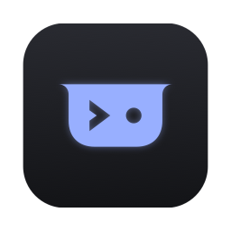
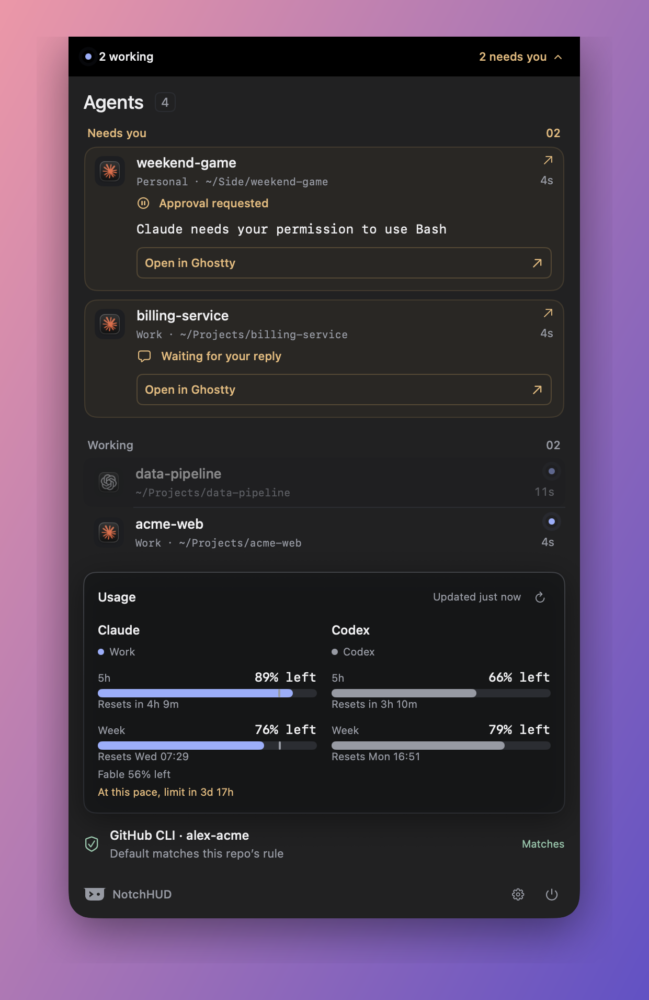
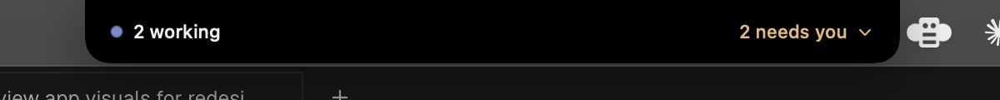
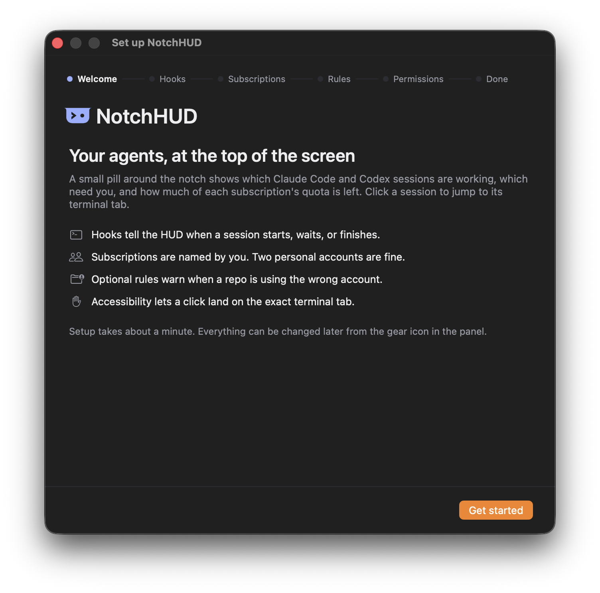
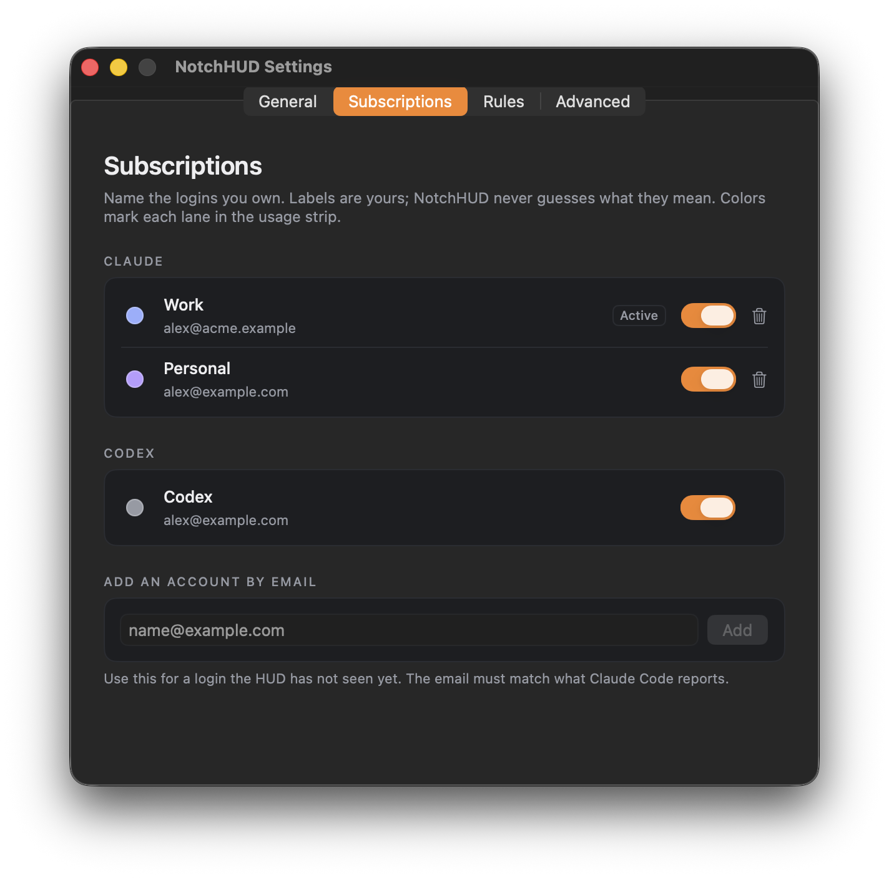
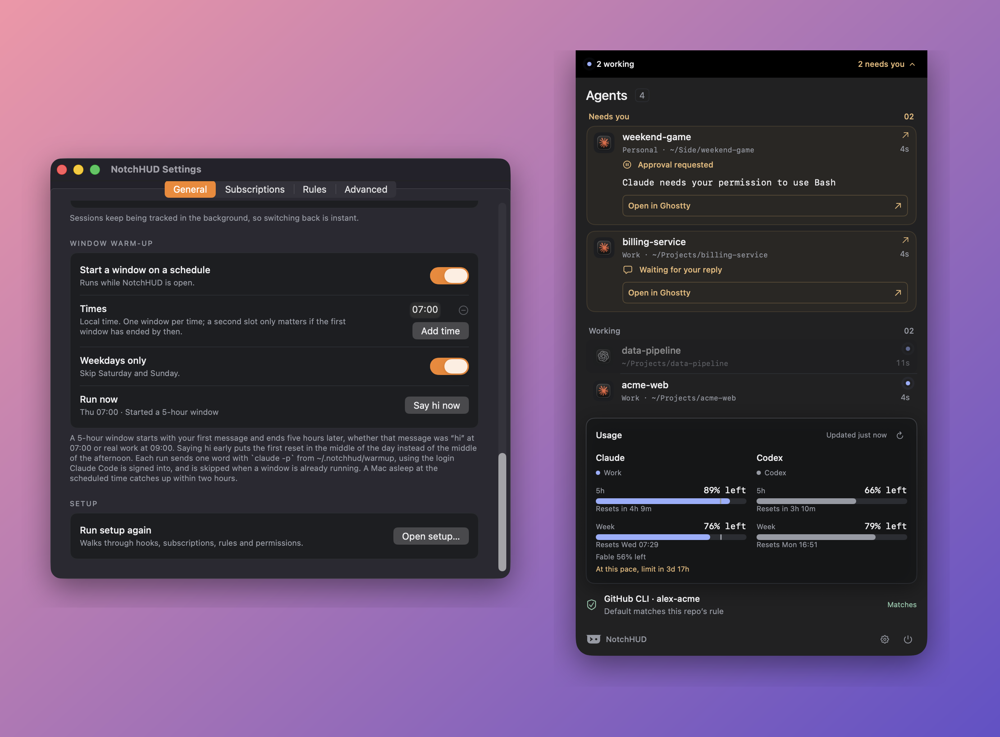
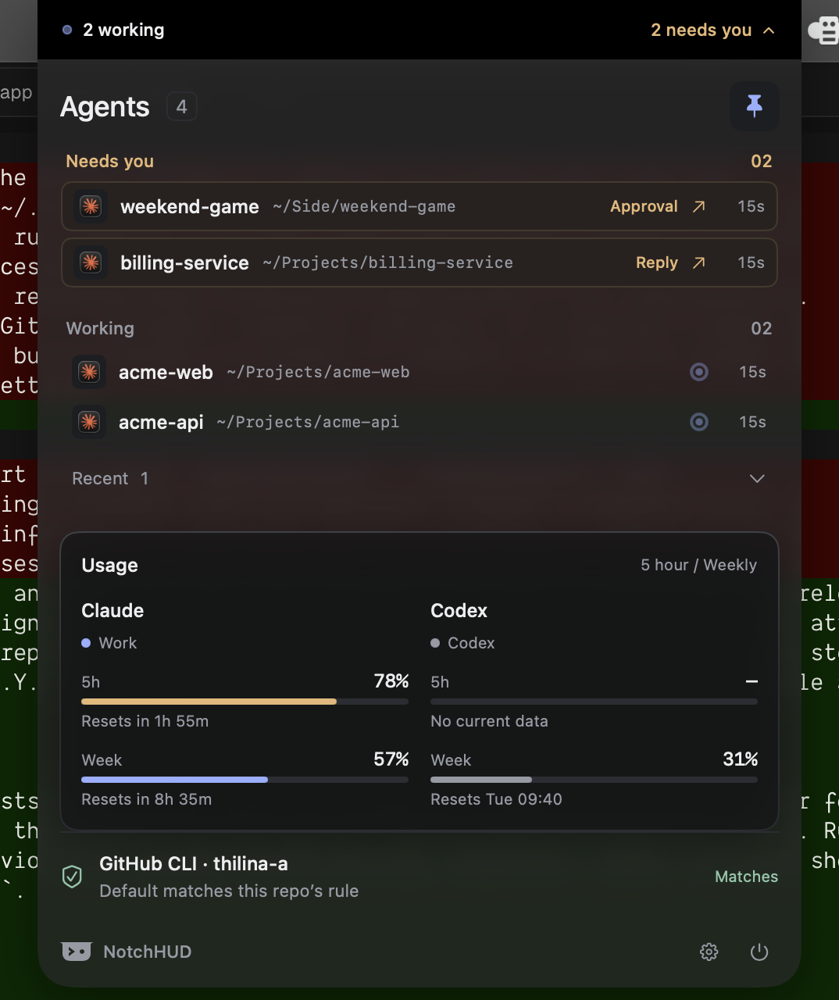

<p align="center">
  
</p>

<h1 align="center">NotchHUD</h1>

<p align="center">
  Your coding agents, at the top of the screen.<br>
  A tiny macOS HUD around the notch that shows which <b>Claude Code</b> and <b>Codex</b> sessions are working,
  which need you, and how much of each subscription's quota is left, with the pace you are burning it at,
  alerts before you hit a limit, and a scheduler that starts your 5-hour window before you sit down.
</p>

<p align="center">
  <a href="https://github.com/thilinaa/notch-agent-hud/releases/latest"></a>
  
  <a href="LICENSE"></a>
</p>

<p align="center">
  
</p>

## What it does

- **A pill around the notch** (or a small capsule under the menu bar on other displays) shows `2 working · 1 needs you` at a glance. The working dot pulses while agents are busy.
- **Click to expand.** Sessions that need you come first, as cards with the full request text and an *Open in Ghostty* button. Working and completed sessions follow. Click any row to jump to the exact terminal tab.
- **Usage per subscription.** 5-hour and weekly windows for every Claude account you own and for Codex, with reset times, as bars or rings, read as used or remaining. The active Claude login uses the same endpoint as `/usage` inside Claude Code, so the numbers are exact, including per-model weekly caps. A pace tick on every meter shows how far the window has run; when quota is going faster than time, one line says when the limit lands.
- **Alerts and a warm-up.** Notification Center tells you when a window nears its limit, hits it, or resets. An optional schedule says hi to Claude early in the morning so the first 5-hour window is already running when you sit down.
- **GitHub account guard.** Reads the active `gh` account and warns when it does not match the one your rules expect for the repository you are working in, with a one-click *Switch*.
- **Multiple accounts, your labels.** Two work accounts, two personal ones, whatever you have. You name them; the app never guesses what a label means.
- **Three densities**, light and dark, a **usage-only mode** for when you just want a quota meter, and a setup flow that takes about a minute.

<p align="center">
  
</p>

## Install

1. Download the latest `NotchHUD-x.y.z.dmg` from [Releases](https://github.com/thilinaa/notch-agent-hud/releases/latest), open it, and drag NotchHUD to Applications.
2. Launch it. The pill appears at the top of the screen and the setup window opens.
3. Follow setup: it installs the Claude Code hooks, names your subscriptions from the login it detects, lets you add repository rules (optional), and asks for the Accessibility permission that terminal-tab focus needs.

To start it at login: System Settings → General → Login Items → add NotchHUD.

Releases are signed with a Developer ID and notarized, so macOS opens them without warnings.

<p align="center">
  
</p>

## How it works

- **Claude Code** sessions report through hooks. Setup adds a small relay script to five hooks in `~/.claude/settings.json` (SessionStart, UserPromptSubmit, Notification, Stop, SessionEnd) and keeps a timestamped backup of the file. The relay tags each event with the hosting app, the `claude` process id, and the active login, then POSTs it to `http://127.0.0.1:48618/event`. Nothing leaves your Mac. Cloud sessions cannot reach localhost and will not appear.
- **Codex** sessions are detected by watching `~/.codex/sessions/*.jsonl`: fresh writes mean *Working*, quiet means *Needs input*, half an hour of silence means *Recent*. The rollout header supplies the working directory and the first prompt as a title. Codex's own usage report inside the rollout feeds the usage strip.
- **Usage** for the active Claude login comes from Anthropic's OAuth usage endpoint, using the token Claude Code already stores in the Keychain. The token is read in-process, sent only to `api.anthropic.com`, and never written anywhere. Other Claude accounts fall back to estimates summed from transcripts, and a rate-limit event teaches the ceiling.
- **Self-healing.** Hook events can be lost when the HUD restarts, so states are re-checked every 15 seconds against the transcript's modification time and the process list. Sessions persist across restarts and recents are kept for 7 days.
- **Terminal focus.** Clicking a row activates the hosting app. For Ghostty it uses the native AppleScript API to select the terminal by working directory. Orca sessions use the terminal handle they were started with. Other terminals get app-level activation.

## Settings

Open Settings from the gear icon in the panel footer or with `open notchhud://settings`. Edits apply live and save to `~/.notchhud/config.json`, which is also watched, so a hand edit in a text editor applies without a relaunch.

<p align="center">
  
</p>

- **General** — density (*Cozy*, *Compact*, or *Minimal*, one line per session so long lists fit), open on hover (off by default: the pill is click-to-open and stays open until clicked again), appearance (System, Light, Dark), and the accent that colors the working indicator.
  - **Usage** — show quota as *Used* (`34%`, a meter that fills) or *Remaining* (`66% left`, a meter that drains); the meter as *Bars* or *Rings* (the week nested inside the 5-hour window, tightest number in the middle); and *Quota on the pill*, which puts the subscription closest to a limit where "All clear" would be.
  - **Alerts** — one notification when a window crosses the threshold (50/70/80/90%), one when it hits the limit, and one when a window that ran hot resets. macOS asks once to allow them; *Send a test* checks the permission.
  - **Window warm-up** — a 5-hour window starts with your first message and ends five hours later, whether that was "hi" at 07:00 or real work at 09:00. Set one or more times (weekdays only by default) and NotchHUD runs `claude -p hi` from `~/.notchhud/warmup` at that moment, using the login Claude Code is signed into. It is skipped when a window is already running, a Mac asleep at the time catches up within two hours, and the last outcome shows in Settings. Each run costs one short message.
  - **Usage-only mode** — the pill shows each subscription's tightest window as a colored dot and percentage, and the panel shows just the usage grid and the GitHub guard. Sessions that need you still break through unless you silence that too.
- **Subscriptions** — the logins you own. Rename each in your own words, pick a lane color, hide a lane without deleting it, remove accounts you no longer use. Logins the HUD has seen but you have not named appear under *Seen on this Mac* with a one-click *Name it*. Codex is listed once it is detected.
- **Rules** — folder and GitHub-owner rules, each with an expected subscription and an expected `gh` account. Owner rules beat folder rules, and among folders the longest match wins. Folders come from a picker or from suggestions based on where your sessions actually run.
- **Advanced** — hook status with a one-click installer, Accessibility status, a switch for exact usage from Anthropic's API (reads the token Claude Code keeps in the Keychain; off means estimates only and no Keychain access), the default terminal, the Codex app bundle id, and the relay port.

<p align="center">
  
</p>

<p align="center">
  
</p>

## Config file

`~/.notchhud/config.json` is created on first run. Every field is optional.

```json
{
  "version": 2,
  "port": 48618,
  "terminalApp": "Terminal",
  "codexApp": "com.openai.codex",
  "subscriptions": [
    { "id": "5D2A…", "provider": "claude", "email": "me@company.example", "label": "Work", "accent": "blue", "visible": true },
    { "id": "9F10…", "provider": "claude", "email": "me@example.com", "label": "Home", "accent": "violet", "visible": true },
    { "id": "codex", "provider": "codex", "email": null, "label": "Codex", "accent": "graphite", "visible": true }
  ],
  "rules": [
    { "id": "…", "kind": "pathPrefix", "value": "~/Work", "ghAccount": "me-work", "subscriptionID": "5D2A…" },
    { "id": "…", "kind": "owner", "value": "company", "ghAccount": "me-work", "subscriptionID": "5D2A…" }
  ],
  "preferences": {
    "density": "cozy", "appearance": "system", "accent": "blue",
    "usageOnly": false, "attentionBreaksThrough": true, "onboardingCompleted": true,
    "useUsageAPI": true, "openOnHover": false,
    "usageValue": "used", "usageMeter": "bars", "pillShowsUsage": false,
    "usageAlerts": true, "alertThreshold": 80
  },
  "warmup": { "enabled": false, "times": ["07:00"], "weekdaysOnly": true, "graceMinutes": 120 }
}
```

- `accent` is one of `blue violet teal green amber rose graphite`. Amber and red are reserved for state (attention, limits) and never used as a lane color's meaning.
- A login not listed under `subscriptions` shows up as an unlabeled lane named after the email's local part.
- `usageValue` is `used` or `remaining`; `usageMeter` is `bars` or `rings`; `alertThreshold` is a percent from 1 to 99. Warm-up `times` are `HH:mm` in local time and `graceMinutes` (5 to 720) is how late a missed slot may still run.
- Files written next to it: `sessions.json` (tracked sessions), `usage-ceilings.json` (learned limits), `usage-alerts.json` (which alerts have fired), `warmup-runs.json` (warm-up outcomes), `notify.sh` (the hook relay), `focus.log` (terminal-focus diagnostics), and `warmup/`, the scratch directory the warm-up runs in.
- `GET http://127.0.0.1:48618/state` returns the current sessions, usage, subscriptions and guard as JSON. It is bound to localhost only, but note that it includes your account emails and session paths in clear text for any local process that asks.

Older v1 files (`claudeAccounts`, `pathAccounts`, `ownerAccounts`) are migrated automatically on first launch and kept as `config.v1.backup.json`.

## URL scheme

| URL | Effect |
| --- | --- |
| `notchhud://settings` | Open Settings (`/general`, `/subscriptions`, `/rules`, `/advanced` pick a tab) |
| `notchhud://setup` | Run the setup flow again |
| `notchhud://panel/open` · `/close` | Pin the panel open or collapse it, for scripts and screenshots |
| `notchhud://warmup/run` | Say hi to Claude now, as the warm-up schedule would |
| `notchhud://alerts/test` | Post one test notification |

## Privacy

Everything stays on your Mac. The only network call NotchHUD makes itself is to `api.anthropic.com` for the active login's usage, using the token Claude Code already holds; the token is never persisted or logged, the response is never cached to disk, and the whole thing can be switched off in Advanced. The warm-up, when you turn it on, runs the `claude` command line the same way you would, and that sends one short message to your Claude account. The HUD reads `~/.claude` transcripts and `~/.codex` rollouts to detect sessions and estimate usage, runs `git` to read a repository's origin, and reads the `gh` CLI's `hosts.yml` to know which account is active. No analytics, no update checks.

## Build from source

Requires Xcode 26 or newer (the panel uses the macOS 26 glass effects behind an availability check, so the SDK must be present). The app itself runs on macOS 14 or newer.

```sh
git clone https://github.com/thilinaa/notch-agent-hud.git
cd notch-agent-hud
swift test                 # 43 tests
./scripts/make-app.sh      # → build/NotchHUD.app
open build/NotchHUD.app
./scripts/install-hooks.sh # optional: install the Claude Code hooks from the terminal
```

Set `NOTCHHUD_HOME=/some/dir` when launching to point the whole app at another home directory (config, sessions, Claude and Codex files, `gh` config); handy for testing and for screenshots that must not show your real data.

`make-app.sh` signs with a Developer ID certificate if you have one, otherwise with an Apple Development certificate, otherwise ad-hoc. Ad-hoc builds lose the Accessibility grant on every rebuild, which is why a real certificate is preferred for day-to-day development.

### Cutting a release

Tag a commit `vX.Y.Z` and push the tag. The [release workflow](.github/workflows/release.yml) builds with the hardened runtime, signs with Developer ID, notarizes, staples, wraps a DMG, and attaches it to a GitHub Release. It needs five repository secrets, listed at the top of that file. The same steps run locally with `./scripts/release.sh vX.Y.Z` when the certificate and a `notarytool` keychain profile are present.

## Contributing

Issues and pull requests are welcome. Keep the graphite surfaces and reserve color for state; the design language is described in the comments at the top of `Sources/NotchHUD/HUDView.swift`. Run `swift test` before opening a PR. New behavior that touches config parsing, migration, hooks, or rules should come with a test in `Tests/NotchHUDTests`.

## License

[MIT](LICENSE)
